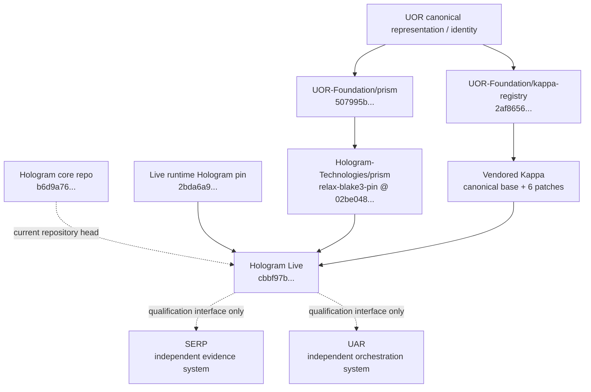
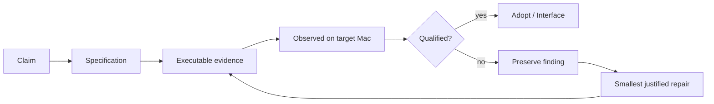
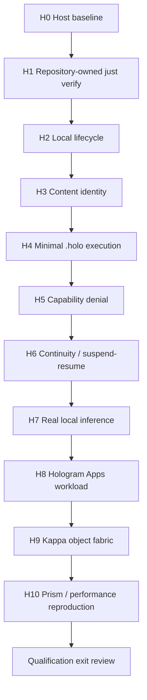

# Holo Lab Validation & Diagram Commitment Audit — 2026-10-06

Status: AUDITED; EXECUTION CAMPAIGN NOT YET COMPLETE  
Qualification target: JH9384/hologram-live @ cbbf97b5b8199f5701c621cd3ba0b26187417ffa

## Bottom line

The repository/intake review commitments have been completed and reconciled. The target-Mac qualification commitments have been specified but have not yet been executed. Two material open findings remain outside the Hologram Live release-gate green state:

1. current Hologram core Release CI repeatedly fails its bare-metal UEFI boot witness;
2. Iroh Phase 2a/2b design documents say "designed, not implemented" even though implementation has landed, and no explicit p2p test lane was found in the inspected default workflows.

No integration into SERP or UAR has been performed.

## Commitment crosswalk

| Promised activity | Evidence reviewed | Status |
|---|---|---|
| Inventory JH9384 Hologram-family forks | Hologram Technologies and humuhumu33 lineages separated | DONE |
| Distinguish provenance/ownership lineages | direct forks, adjacent experimental forks, canonical UOR repos | DONE |
| Refresh stale hologram-live fork | exact fast-forward e9247c9 -> cbbf97b, no divergence | DONE |
| Inspect the 20-commit delta | 145 changed files; model hub/tensors, Prism/LexLean, Iroh, cost model, tests/docs inspected | DONE |
| Inspect Hologram Live actual capabilities | ACTUAL_CAPABILITIES.md + ARCHITECTURE.md + Cargo/Justfile | DONE |
| Inspect AI operations/performance claims | HOLOGRAM_AI_OPERATIONS_AND_CAPABILITIES.md + cost_model.rs | DONE; claims demoted where modeled |
| Inspect model-byte/tensor provenance | tensor README/pipeline, verifier/deploy surfaces | DONE |
| Inspect Prism integration | prism-hologram, canonical Prism, compatibility patch lane | DONE |
| Inspect LexLean/formalization | lexlean.toml and formal source presence | DONE |
| Inspect Kappa provenance | canonical UOR revision, vendored record, six carried patches, SHA inventory | DONE |
| Inspect Iroh transport/replication | design docs, source/dependency surfaces, enforced feature | DONE; validation gap OPEN |
| Check Hologram Live repository release gates | gates + registry-os + ci exact SHA on JH9384 fork | PASS |
| Check Hologram Live nightly artifact gate | upstream gates-nightly exact SHA | PASS |
| Check model-hub client/OpenAPI workflows after refresh | exact SHA on JH9384 fork | PASS |
| Check Hologram core conformance/V&V | latest Release CI jobs | PARTIAL: docs + Holospaces PASS; bare-metal FAIL |
| Check architecture/diagram inventory | Live architecture + core/Holospaces C4/OPM/arc42 | DONE |
| Verify diagrams are validated | core docs-conformance V1-V8 | PASS |
| Freeze qualification plan | QUALIFICATION_BASELINE_2026-10-06.md | DONE |
| Run H0 host baseline on target Mac | requires target Mac observation | NOT RUN |
| Run H1 just verify on target Mac | requires target Mac execution | NOT RUN |
| Run H2 local lifecycle | campaign execution | NOT RUN |
| Run H3 content identity round trip | campaign execution | NOT RUN |
| Run H4 minimal .holo execution | campaign execution | NOT RUN |
| Run H5 capability denial | campaign execution | NOT RUN |
| Run H6 continuity/suspend-resume | campaign execution | NOT RUN |
| Run H7 real local inference | campaign execution | NOT RUN |
| Run H8 one Hologram Apps workload | campaign execution | NOT RUN |
| Run H9 Kappa object-fabric experiment | campaign execution | NOT RUN |
| Run H10 Prism/performance reproduction | campaign execution | NOT RUN |
| SERP projection experiment | intentionally after qualification | DEFERRED BY DESIGN |
| UAR execution adapter experiment | intentionally after qualification | DEFERRED BY DESIGN |
| Kappa shared-fabric experiment | intentionally after qualification | DEFERRED BY DESIGN |

## Validation layers

### Layer 1 — Source/repository validation

Hologram Live exact qualification SHA has green fork runs for the three workflows named by its release gate:

- gates
- registry-os
- ci

The same SHA also has green model-hub client and OpenAPI runs. Upstream gates-nightly is green.

This is repository evidence, not target-Mac evidence.

### Layer 2 — Core substrate validation

Hologram core current head has extensive conformance infrastructure:

- CONFORMANCE.md
- VERIFICATION.md
- hologram-conformance crate
- archive/compute/exec/store/TCK conformance tests
- Holospaces CC V&V suites
- product-security and extension-egress suites
- x64 and aarch64 lifecycle/boot suites
- arc42/C4/OPM/ISO 15288 docs validation

Latest observed Release CI:
- Holospaces V&V: PASS
- CS docs conformance V1-V8: PASS
- Browser OPFS: PASS
- fuzz: PASS
- SDK/package lanes inspected: PASS
- Bare-metal UEFI boot: FAIL

The overall core baseline is therefore not currently green.

### Layer 3 — Holo Lab observed validation

None yet. H0-H10 are the mechanism that turns repository truth into observed truth on John's target Mac.

## Diagram inventory and reconciliation

### Existing product boundary — Hologram Live

The repository's current architecture describes this boundary:

```text
Tauri Desktop ---- managed sidecar ---+
CLI ------------------ gRPC ----------+--> Hologram daemon
Browser ------------- JSON/HTTP ------+       |
                                              +--> registry module
                                              +--> .holo module
                                              +--> history module
```

This is a product-boundary diagram, not an ecosystem integration diagram.

### Existing Holospaces architecture diagrams

Current Hologram core contains and validates:

- C4 L1 system context
- C4 L2 Holospaces containers
- OPM SD system diagram
- OPM SD1 provisioning
- OPM SD2 lifecycle
- OPM SD3 identity
- OPM SD4 projecting
- OPM SD5 devcontainer

Their source is retained under the consolidated Holospaces specification tree, with arc42 sections for context, constraints, solution strategy, building blocks, runtime, deployment, decisions, risks, and product security.

### Evidence-based ecosystem provenance diagram



Important: the Hologram core current repository head and the Hologram revision actually pinned by Hologram Live are different facts.

### Qualification evidence flow



### H0-H10 campaign



## Open validation findings

### VA-001 — Core bare-metal witness red — ROOT CAUSE ISOLATED

Controlled runs on the unchanged Hologram source isolate the red Oct 2–6 release witness to Rust 1.99 / LLVM 23: Rust 1.98.1 builds and boots; unmodified Rust 1.99.0 fails at link with `undefined symbol: wcslen`; Rust 1.99.0 with the LLVM wcslen loop-idiom transformation disabled builds and boots.

This matches rust-lang/rust #160827 and the compiler-builtins `wcslen` correction. Treat this as a toolchain/reproducibility finding, not a Hologram bare-metal runtime failure. Upstream Release CI remains operationally red until its workflow/toolchain policy changes.

### VA-002 — Iroh status drift and p2p test coverage

The Iroh transport and iroh-blobs design documents still say designed/not implemented, while source and dependencies are present. The inspected workflows do not explicitly invoke a p2p feature test lane.

Required qualification action:
- cargo check/test with p2p enabled;
- run Iroh-specific integration tests;
- prove the dependency forbidden-crate gate with oci,p2p;
- reconcile design status after evidence.

### VA-003 — Performance report mixes evidence classes

The PrismPM report contains real CLI measurements alongside formal/cost-model projections and hard-coded comparison constants in cost_model.rs. These must remain separate.

H10 must label:
- formal proof/model;
- microbenchmark;
- end-to-end inference measurement.

### VA-004 — Reproducibility workflows are not equivalent to H1

Component reproducibility includes macOS ARM64 and x86_64 clean builds, while rootfs reproducibility currently covers Linux amd64/arm64. These are valuable existing witnesses but do not replace running the exact qualification SHA on the target Mac.

## Audit conclusion

We completed the promised repository review, provenance review, delta inspection, validation inventory, and diagram inventory.

We have NOT completed the promised observed qualification campaign. That begins with H0/H1 on the target Mac.

The correct project state is:

REPOSITORY INTAKE: COMPLETE
DIAGRAM/VALIDATION ACCOUNTING: COMPLETE
HOLOGRAM LIVE RELEASE GATES: GREEN AT QUALIFICATION SHA
HOLOGRAM CORE OVERALL RELEASE CI: RED, ROOT CAUSE ISOLATED — RUST 1.99 / LLVM 23 WCSLEN TOOLCHAIN REGRESSION
TARGET-MAC H0-H10: NOT YET EXECUTED
SERP/UAR INTEGRATION: NOT STARTED BY DESIGN
